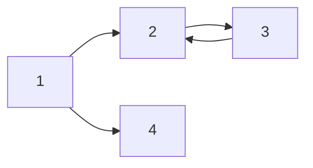

- [ ] 체크박스 

# H1 태그
# H2 태그
### H3 Tag
#### H4 Tag

*기울임이탤릭*
_기울임이탤릭_
**진하게**
**_이탤릭+진하게_**
~~줄긋기~~

> 인용문Quote

*띄 순서없는리스트(특징나열)
-띄 순서없는리스트
- list 1
- list 2
- list 3
    - A
        - B
- **무결성** : 특징정리는 리스트와 진하기를 섞어서 쓰면 좋다
- **간결성** : 특징소개

1. list 1
3. list 2
3. list 3
    1. A
        1. B


|컬럼명||
|-|-|-|
|내용||

--- 
바바바 구분선

[링크이름](링크주소)
[네이버](never.com)
<a href="naver.com">링크이름</a>


[](https://colab.research.google.com/github/EGEG1212//Machine-Learning-2020/blob/main/08.AI-Site/04_KAKAO_언어감지.ipynb)


##### 자동중앙정렬 와이드100%
##### 싫다면 아래와같이 img태그

---

`코드명령어`   강조됨
`simple code`

``` python 파이썬문법으로 색을입혀줌 cpp sh쉘?
코드
명령어 
여러줄
```
``` python #원하는문법으로
#include <stdio.h>

int main(){
    printf("hello world");
    return 0;

}
```

``` sh #결과같은거
hello
```

### carbon.now.sh 코드스샷툴

---
### 레이택LaTex문법
텍스트중앙에 $a+b=c$ 넣을수있는 달러표시1개
$a^2_1 + b^2 = c^2$
다음 중 $N$개를 고르시오.

달러표시2개는 가운데정렬.인라인처리됨$$(\alpha + \beta)^2 = \alpha^2 + 2 \alpha \beta + \beta^2$$

$$min_Gmax_D$$

$\alpha \beta \frac{1}{2}$

$수학기호$ 달러 글중간에 인라인표시
$$중간배열+수학기호$$ 달러2개
---

texpad 검색해서 문법
```mermaid
다이어그램그려줌 ㅋㅋ
```