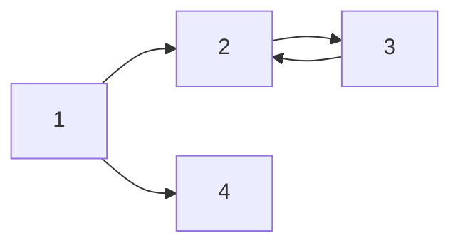

# 마크다운이란

> 마크다운(markdown)은 일반 텍스트 문서의 양식을 편집하는 문법이다. README 파일이나 온라인 문서, 혹은 일반 텍스트 편집기로 문서 양식을 편집할 때 쓰인다. 마크다운을 이용해 작성된 문서는 쉽게 HTML 등 다른 문서형태로 변환이 가능하다. <br> -_위키백과_

<br><br>

## 🤔제목(Hearder)

`h1`부터 `h6`까지 표현할 수 있으며, `#`의 개수로 표현 가능합니다.<br>
==, --, -------- 로도 표현 가능합니다.<br>
✍작성코드(.md)<br>


👉결과

# H1 태그

## H2 태그

### H3 Tag

#### H4 Tag

# 헤더처럼 크고 진하게

## 헤더처럼 크고 진하게

---

## 🤔수평선

<p>

`*`이나 `-`, `_`등을 3개 이상 입력하면 구분선, 수평선이 됩니다.<br>
띄어쓰기를 중간에 삽입해도 가능합니다.<br>
다만, 하이픈 `-`은 헤더로 인식할 수도 있으니 주의해서 사용할 필요가 있습니다.
<br>✍작성코드(.md)

```
***
---
-- -- -- --
```

👉결과<br>

---

---

---

<br>

---

</p>
## 🤔리스트
#### 1. 순서가 없는 리스트

특징을 나열할 때 사용합니다.<br>
`-`, `*`, `+` 을 사용하여 ✨한칸 띄어서 작성합니다.(모두 동일하게 적용)<br>
인라인코드, 블럭코드를 작성할 수 있으며 `Tab`키나 `space 바`를 이용해 들여쓰기가 가능합니다.

<br>✍작성코드(.md)

```
- list 1 (찐동그라미)
- list 2
- list 3
    - A (한번 Tab 흰동그라미)
        - B (두번 Tab 찐네모)
- **무결성** : 특징정리는 리스트와 진하기를 함께 사용하면 좋다
- **간결성** : 특징소개
* list
    * list
        * list
+ list
    + list
        + list
        두번 Tab하면 코드 블럭을 만들 수 있어요.
```

👉결과<br>

- list 1
- list 2
- list 3
  - A
    - B
- **무결성** : 특징정리는 리스트와 진하기를 섞어서 쓰면 좋다.
- **간결성** : 특징소개

* list
  - list
    - list

- list
  - list
    - list

#### 2. 순서가 있는 리스트

`1.`, `2.`와 같이 `숫자`와 `.`을 `띄어써서` 작성합니다.
<br>✍작성코드(.md)

```
1. list 1
3. list 2
3. list 3
    1. A
        1. B
```

👉결과

1. list 1
2. list 2
3. list 3
   1. A
      1. B

---

## 🤔문단간격

<p>
문단의 간격은 `줄 바꿈`으로 나타내며, `<br>`을 사용합니다.
<br>✍작성코드(.md)

```
첫 번째 문단<br><br>
두 번째 문단
```

👉결과
첫 번째 문단<br><br>
두 번째 문단

---

</p>
## 🤔폰트 스타일
<p>
컬러는 html 태그를 이용하여 작성합니다.
<br>✍작성코드(.md)

```
*기울임이탤릭*
_기울임이탤릭_
**진하게**
__진하게__
**_이탤릭+진하게_**
~~취소선~~
~글씨작게~
<span style="color:red">red</span>
<span style="color:#d3d3d3">#d3d3d3</span>
<span style="color:rgb(245, 235, 13)">rgb(245, 235, 13)</span>
```

👉결과<br>
_기울임이탤릭_ <br>
_기울임이탤릭_<br>
**진하게**<br>
**진하게**<br>
**_이탤릭+진하게_**<br>
~~취소선~~<br>
~글씨작게~<br>

<span style="color:red">red</span><br>
<span style="color:#d3d3d3">#d3d3d3</span><br>
<span style="color:rgb(245, 235, 13)">rgb(245, 235, 13)</span><br>

---

</p>

## 🤔인용문Quote

<p>
인용문을 작성할 때에는 `>`를 사용합니다.
<br>✍작성코드(.md)

```
>인용문작성하기
-작성자
>> 인용문작성하기
>>>인용문작성하기
>>>>인용문작성하기
>>>>>몇개까지가능한가(5개;)
```

👉결과

> 인용문Quote작성하기 -작성자
>
> > 인용문작성하기
> >
> > > 인용문작성하기
> > >
> > > > 인용문작성하기
> > > >
> > > > > 몇개까지가능한가

---

</p>

## 🤔인라인 코드

<p>
`` 백틱( ` ) ``을 사용하여 인라인 코드를 작성합니다.
<br>✍작성코드(.md)

```
`인라인 코드 작성은 백틱 한개씩`
```

👉결과<br>
`인라인 코드 작성은 백틱 한개씩`

---

</p>
## 🤔코드 블럭(코드 여러 줄) & 하이라이트
<p>
`` 백틱( ` ) ``을 3개 사용하여 코드블럭을 작성합니다.<br>
첫번째줄 백틱3개 옆에 원하는 문법을 입력하면 색을 입혀줍니다.<br>
예) python cpp sh쉘 javascript<br>
[carbon.now.sh](carbon.now.sh) 코드스샷툴✨을 사용하기도 합니다.
<br>✍작성코드(.md)

````
``` python
#include <stdio.h>

int main(){
    printf("hello world");
    return 0;
}
```
``` sh
결과는 보통 sh로 합니다.
```
````

👉결과

```python
#include <stdio.h>

int main(){
    printf("hello world");
    return 0;
}
```

```sh
결과는 보통 sh로 합니다.
```

---

</p>

## 🤔링크(Link)

<p>
<br>✍작성코드(.md)

```
1.인라인 링크는 아래처럼
[네이버](https://never.com/)
<a href="naver.com">네이버 바로가기</a>

2.url링크는 아래처럼
<https://never.com/>

3.참조링크는 아래처럼
[참조링크]:(https://never.com/)
```

👉결과 <br> 1.인라인 링크는 아래처럼
[네이버](https://never.com/)
<a href="naver.com">네이버 바로가기</a>

2.url링크는 아래처럼
<https://never.com/>

3.참조링크는 아래처럼
[참조링크]:(https://never.com/)

---

</p>

## 🤔이미지 & 링크추가

<p>
이미지 크기는 10MB 이하만 가능합니다. (gif 포함)<br>
자동중앙정렬 와이드100%로 삽입됩니다.<br>
✨사이즈를 조절하고 싶다면 img태그 ``로 작성합니다.<br>
``<br>
`[](연결하고자하는 url "마우스 오버 시 나타낼 링크 title")`
<br>✍작성코드(.md)

```


[](https://colab.research.google.com/github/EGEG1212//Machine-Learning-2020/blob/main/08.AI-Site/04_KAKAO_언어감지.ipynb)
```

👉결과<br>


[](https://colab.research.google.com/github/EGEG1212//Machine-Learning-2020/blob/main/08.AI-Site/04_KAKAO_언어감지.ipynb)

---

</p>
## 🤔테이블(Table)
<p>
`|`로 셀을 구분하며 폰트의 기본적인 스타일이 모두 적용 가능합니다.<br>
`-`하이픈으로 구분된 셀 왼쪽, 양쪽, 오른쪽에 `:`콜론을 붙일 경우<br>
왼쪽정렬, 가운데정렬, 오른쪽정렬이 가능합니다.

<br>✍작성코드(.md)

```
| 드라마 제목 | 주연 배우 | 방영일 |
|:--|:--:|--:|
| **호텔 델루나** | 이지은, 여진구 | ~~2019.07.13. ~ 2019.09.01.~~ |
| 타인은 지옥이다 | 임시완, 이동욱, 이현욱, 이정은 | 2019.08.31. ~ |
| 멜로가 체질 | 천우희, 안재홍, 전여빈, 공명 | 2019.08.09. ~ |
```

👉결과<br>
| 드라마 제목 | 주연 배우 | 방영일 |
|:--|:--:|--:|
| **호텔 델루나** | 이지은, 여진구 | ~~2019.07.13. ~ 2019.09.01.~~ |
| 타인은 지옥이다 | 임시완, 이동욱, 이현욱, 이정은 | 2019.08.31. ~ |
| 멜로가 체질 | 천우희, 안재홍, 전여빈, 공명 | 2019.08.09. ~ |

---

</p>

## 🤔체크박스(Check Box)

<p>
`-`, `*`, `+` 뒤에 띄어쓰기 후 `[ ]`대괄호를 넣어 또 한칸띄고 작성합니다.

<br>✍작성코드(.md)

```
- [ ] 체크박스
- [x] 체크박스
* [ ] 체크박스
* [X] 체크박스
+ [ ] 체크박스
+ [x] 체크박스
```

👉결과

- [ ] 체크박스
- [x] 체크박스

* [ ] 체크박스
* [x] 체크박스

- [ ] 체크박스
- [x] 체크박스

---

</p>

## 🤔레이택문법(LaTex)

<p>
`$`는 인라인, 왼쪽정렬<br>
`$$`는 블럭, 가운데정렬 입니다.
<br>✍작성코드(.md)

```
$a+b=c$
$a^2_1 + b^2 = c^2$
$\alpha \beta \frac{1}{2}$
다음 중 $N$개를 고르시오.

달러표시2개는 한줄에 써도 블럭처리되며, 가운데정렬입니다. $$(\alpha + \beta)^2 = \alpha^2 + 2 \alpha \beta + \beta^2$$

$$min_Gmax_D$$
```

👉결과<br>
$a+b=c$
$a^2_1 + b^2 = c^2$
$\alpha \beta \frac{1}{2}$
다음 중 $N$개를 고르시오.

달러표시2개는 한줄에 써도 블럭처리되며, 가운데정렬입니다. $$(\alpha + \beta)^2 = \alpha^2 + 2 \alpha \beta + \beta^2$$

$$min_Gmax_D$$

---

</p>

## 🤔다이어그램

<p>
texpad 검색하면 더 많은 문법 확인가능합니다.
<br>✍작성코드(.md)

````

````

👉결과


---

</p>

## 🤔이모지

#### 1. 단축키

window10: `윈도우 키` + `.`온점
mac: `Command` + `Control` + `space 바`

#### 2. 트위터이모지

<https://kr.piliapp.com/twitter-symbols/> 의 이모지를 복사->붙여넣기

---

# 마치며...

짧게, 부분적으로 알고 있던 마크다운을 한곳에 모아 보기 편하게 정리했습니다.<br>
역시나 내가 보기 편하게 :-)

---

<br>참고: T아카데미- 안수빈 <https://tacademy.skplanet.com/live/player/onlineLectureDetail.action?seq=171>
깃허브 <https://github.com/subinium>
블로그 <https://subinium.github.io/>

<br>참고: T아카데미- 이수진 <https://tacademy.skplanet.com/live/player/onlineLectureDetail.action?seq=130>
<https://sujinlee.me/professional-github/>
<br>참고: <http://nblog.syszone.co.kr/archives/9917>
